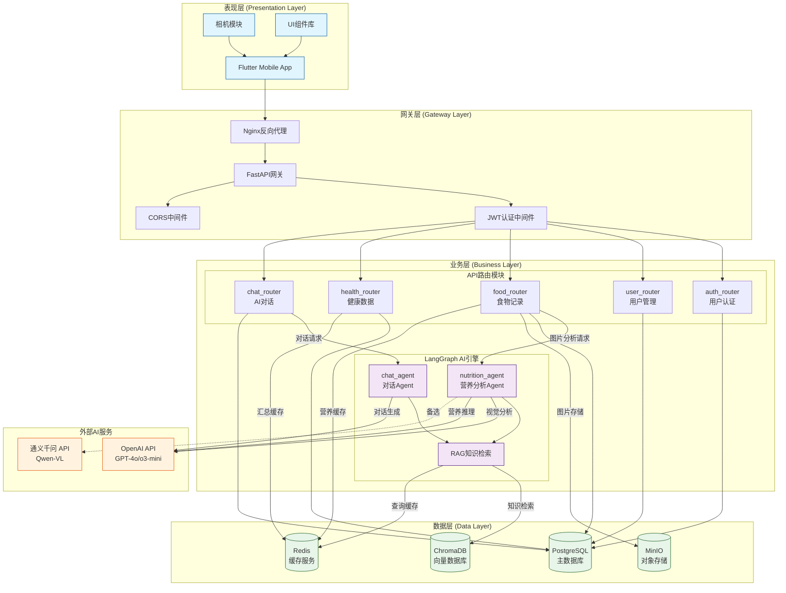
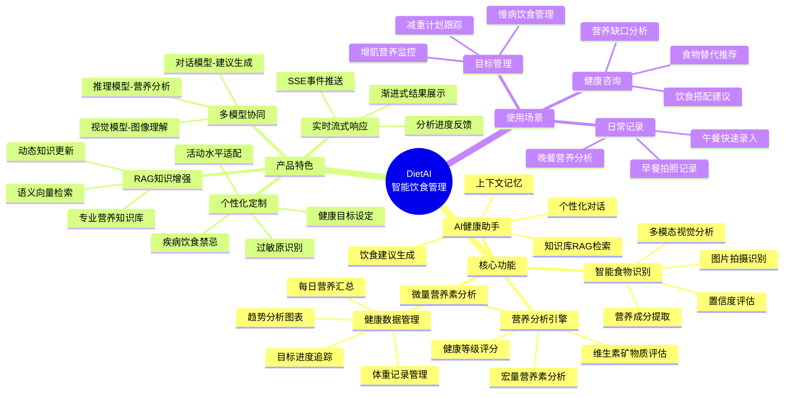
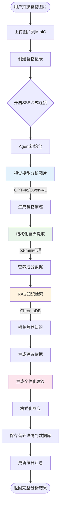
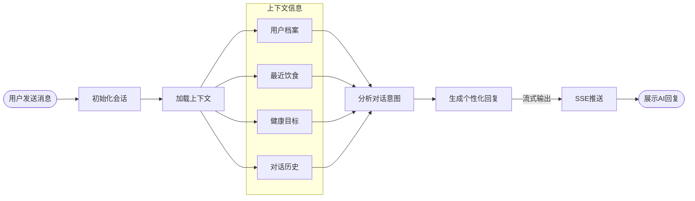
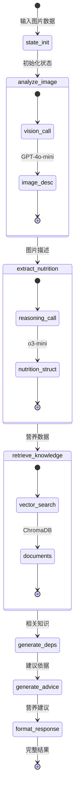
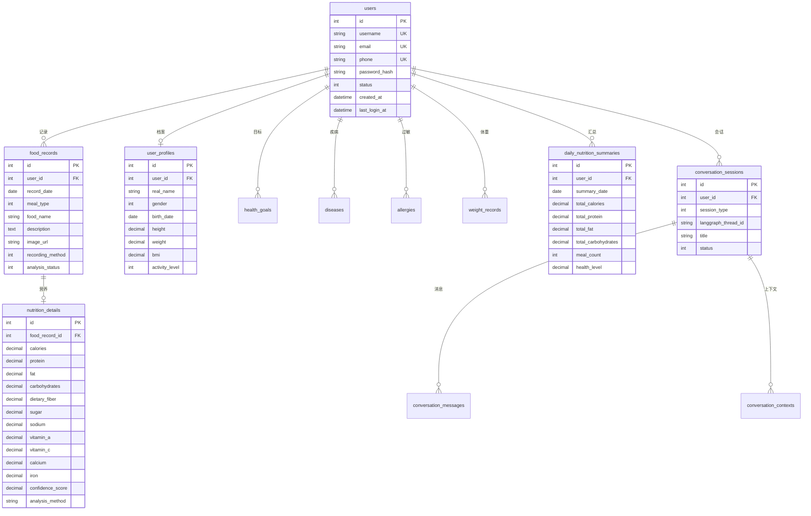
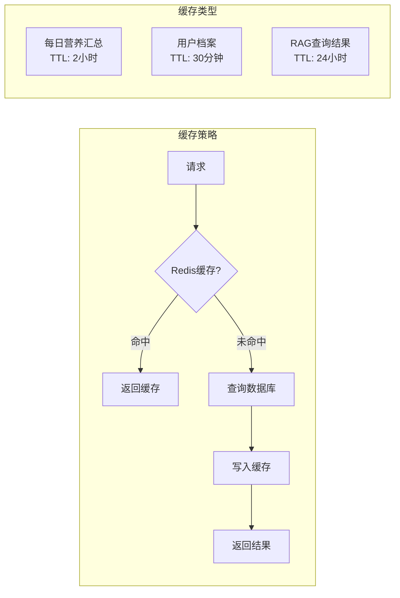
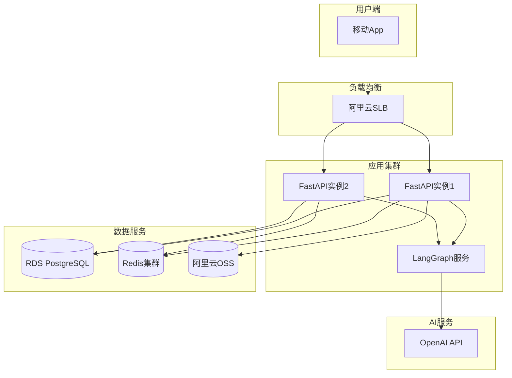

# 第2部分：技术方案

## 2.1 总体架构

### 2.1.1 系统多层架构

DietAI系统采用现代化的分层架构设计，主要分为四个核心层次：

| 层级 | 名称 | 主要职责 | 核心技术 |
|------|------|----------|----------|
| **表现层** | 移动端应用 | 用户界面交互、食物拍照、数据展示 | Flutter + Riverpod |
| **网关层** | API服务网关 | 请求路由、认证鉴权、流量控制、CORS处理 | FastAPI + Nginx |
| **业务层** | 核心业务服务 | 用户管理、食物记录、营养分析、健康评估 | FastAPI + LangGraph |
| **数据层** | 数据存储服务 | 结构化存储、缓存、文件存储、向量检索 | PostgreSQL + Redis + MinIO + ChromaDB |

### 2.1.2 模块架构图



### 2.1.3 架构说明

**1. 表现层 (Flutter Mobile App)**

采用Flutter跨平台框架开发移动应用，使用Riverpod进行状态管理，Go Router处理页面导航。核心功能包括：
- 食物图片拍摄与上传
- 营养数据可视化展示（fl_chart）
- AI助手对话交互
- 健康数据趋势分析

**2. 网关层 (FastAPI Gateway)**

基于FastAPI构建的高性能API网关，提供：
- JWT Token认证与刷新机制
- 请求参数验证与异常处理
- CORS跨域资源共享配置
- 请求日志记录与性能监控
- 统一响应格式（BaseResponse）

**3. 业务层 (LangGraph AI Engine)**

核心AI能力由LangGraph框架驱动，实现两个主要Agent：

- **nutrition_agent（营养分析Agent）**：7步流水线工作流
  ```
  state_init → analyze_image → extract_nutrition → retrieve_nutrition_knowledge
  → generate_dependencies → generate_advice → format_response
  ```

- **chat_agent（对话Agent）**：4步对话工作流
  ```
  initialize_chat → analyze_context → generate_response → format_chat_response
  ```

**4. 数据层 (Data Storage)**

采用多元化存储策略：
- **PostgreSQL**：核心业务数据（用户、食物记录、营养详情、对话历史）
- **Redis**：热点数据缓存（每日营养汇总、RAG查询结果）
- **MinIO**：食物图片对象存储（支持预签名URL安全访问）
- **ChromaDB**：营养知识向量库（支持RAG语义检索）

---

## 2.2 功能详述

### 2.2.1 功能架构思维导图



### 2.2.2 核心功能流程图

#### A. 食物图片分析流程



#### B. AI对话交互流程



### 2.2.3 核心功能详述

| 功能模块 | 功能描述 | 技术实现 | 产品优势 |
|----------|----------|----------|----------|
| **智能食物识别** | 用户拍摄食物照片，AI自动识别食物种类、估算分量 | GPT-4o-mini视觉模型 + 结构化输出 | 无需手动输入，秒级识别 |
| **营养成分分析** | 自动提取热量、蛋白质、脂肪、碳水等20+营养指标 | o3-mini推理模型 + Pydantic结构化 | 专业级营养分析精度 |
| **RAG知识增强** | 基于专业营养知识库进行语义检索，增强建议可靠性 | ChromaDB向量库 + 相似度检索 | 建议有据可依，科学可信 |
| **个性化建议** | 结合用户健康目标、疾病史、过敏信息生成定制建议 | LangGraph状态管理 + 上下文注入 | 千人千面，精准匹配 |
| **流式交互** | 实时返回分析进度和结果，提升用户体验 | SSE (Server-Sent Events) | 即时反馈，体验流畅 |
| **健康趋势** | 可视化展示营养摄入趋势、目标达成进度 | fl_chart图表库 + 数据聚合 | 直观了解健康状况 |

### 2.2.4 产品界面示意（当前进度）

**主要页面结构：**

```
┌─────────────────────────────────────┐
│  DietAI - 首页                       │
├─────────────────────────────────────┤
│  ┌─────────────────────────────┐    │
│  │  今日营养摄入概览            │    │
│  │  热量: 1,850 / 2,000 kcal   │    │
│  │  [████████████░░] 92%       │    │
│  └─────────────────────────────┘    │
│                                      │
│  今日饮食记录                         │
│  ┌──────┐ ┌──────┐ ┌──────┐        │
│  │ 早餐 │ │ 午餐 │ │ 晚餐 │        │
│  │ 450  │ │ 680  │ │ 720  │        │
│  └──────┘ └──────┘ └──────┘        │
│                                      │
│  [ 📷 拍照记录 ]  [ 💬 AI助手 ]      │
├─────────────────────────────────────┤
│  🏠 首页  📊 统计  ➕ 记录  👤 我的   │
└─────────────────────────────────────┘
```

```
┌─────────────────────────────────────┐
│  食物分析结果                        │
├─────────────────────────────────────┤
│  ┌─────────────────────────────┐    │
│  │      [食物图片预览]          │    │
│  └─────────────────────────────┘    │
│                                      │
│  识别结果: 番茄炒蛋 + 米饭           │
│  置信度: 95%                         │
│                                      │
│  营养成分                            │
│  ├─ 热量: 450 kcal                  │
│  ├─ 蛋白质: 18g                     │
│  ├─ 脂肪: 15g                       │
│  └─ 碳水: 52g                       │
│                                      │
│  AI建议                              │
│  "这是一份营养均衡的午餐，建议        │
│   增加一份蔬菜以补充膳食纤维..."      │
│                                      │
│  [ ✓ 确认记录 ]  [ ✏️ 修改 ]         │
└─────────────────────────────────────┘
```

---

## 2.3 关键技术

### 2.3.1 设备条件：低算力移动端流畅体验保障

| 挑战 | 解决方案 | 实现细节 |
|------|----------|----------|
| **图片处理延迟** | 云端AI处理 + 本地预览 | 图片上传至MinIO后由云端Agent处理，本地仅做压缩和预览 |
| **网络带宽限制** | 图片压缩 + 渐进式加载 | 上传前压缩至10MB以内，SSE流式返回分析进度 |
| **UI响应卡顿** | 异步处理 + 状态管理 | Riverpod异步Provider，Flutter isolate处理耗时操作 |
| **电量消耗** | 按需请求 + 缓存策略 | Redis缓存每日汇总，避免重复计算；图片URL预签名缓存 |

**技术实现要点：**

```dart
// Flutter端异步图片上传示例
Future<void> uploadFoodImage(File image) async {
  // 1. 本地压缩
  final compressed = await compressImage(image, quality: 85);

  // 2. 异步上传 + 进度监听
  final response = await dio.post('/foods/upload-image',
    data: FormData.fromMap({'file': await MultipartFile.fromFile(compressed.path)}),
    onSendProgress: (sent, total) => updateProgress(sent / total),
  );

  // 3. SSE流式接收分析结果
  await for (final event in sseClient.stream('/foods/records')) {
    handleAnalysisProgress(event);
  }
}
```

### 2.3.2 技术焦点：LangGraph调度与多模型协同

#### A. LangGraph工作流调度架构



#### B. 多模型协同策略

| 模型角色 | 推荐模型 | 备选模型 | 职责 |
|----------|----------|----------|------|
| **视觉理解** | GPT-4o-mini | Qwen-VL-Max | 食物图像识别、分量估算、烹饪方式判断 |
| **营养推理** | o3-mini | Qwen3-32B | 结构化营养提取、健康等级评估 |
| **知识检索** | text-embedding-ada-002 | 本地Embedding | 营养知识向量化、语义相似度计算 |
| **对话生成** | GPT-4o | Claude-3 | 个性化建议生成、健康咨询对话 |

**模型调用配置示例：**

```python
# agent/utils/configuration.py
@dataclass(kw_only=True)
class Configuration:
    vision_model_provider: VisionModel = VisionModel.OPENAI
    vision_model: str = "gpt-4.1-nano-2025-04-14"  # 视觉模型
    analysis_model_provider: AnalysisModel = AnalysisModel.OPENAI
    analysis_model: str = "o3-mini-2025-01-31"     # 推理模型
```

### 2.3.3 风险因素与对策

#### 风险一：识别延迟

| 风险描述 | 影响程度 | 对策方案 |
|----------|----------|----------|
| 多模型串行调用导致响应时间过长 | 高 | **SSE流式响应**：实时推送分析进度，用户可见处理状态 |
| 网络波动导致请求超时 | 中 | **超时重试机制**：设置30秒超时，失败后自动重试1次 |
| 高峰期并发导致排队 | 中 | **异步任务队列**：Celery后台处理，状态轮询查询 |

**流式响应实现：**

```python
# routers/food_router.py
async def generate_sse_stream(food_data, current_user, db):
    yield f"data: {json.dumps({'type': 'analysis_started', 'message': '开始分析...'})}\n\n"

    async for chunk in analyze_food_image_with_agent(image_url, current_user, db):
        if chunk["type"] == "analysis_progress":
            yield f"data: {json.dumps({'type': 'progress', 'step': chunk['data']['current_step']})}\n\n"
        elif chunk["type"] == "analysis_complete":
            yield f"data: {json.dumps({'type': 'complete', 'data': chunk['data']})}\n\n"
```

#### 风险二：数据隐私

| 风险描述 | 影响程度 | 对策方案 |
|----------|----------|----------|
| 用户健康数据泄露 | 极高 | **数据隔离**：用户数据按user_id严格隔离，API层鉴权校验 |
| 图片存储安全 | 高 | **预签名URL**：MinIO图片访问使用临时URL，默认1小时过期 |
| 传输过程窃听 | 高 | **HTTPS加密**：全链路TLS加密，敏感数据不落日志 |
| 第三方API调用 | 中 | **数据脱敏**：发送AI服务前移除用户身份标识信息 |

**图片安全访问实现：**

```python
# 图片URL获取接口 - 严格权限校验
@router.get("/images/url")
async def get_image_url(object_name: str, current_user: User):
    # 1. 验证对象归属
    if not object_name.startswith(f"food_images/{current_user.id}/"):
        raise HTTPException(status_code=403, detail="无权访问")

    # 2. 生成临时URL（60分钟有效）
    file_url = minio_client.get_file_url(object_name, expires=timedelta(minutes=60))
    return {"file_url": file_url, "expires_in": 3600}
```

#### 风险三：食物识别幻觉

| 风险描述 | 影响程度 | 对策方案 |
|----------|----------|----------|
| AI误识别食物种类 | 高 | **置信度评估**：输出confidence_score，低于阈值提示用户确认 |
| 营养数据估算偏差 | 高 | **RAG知识增强**：检索专业营养数据库校验，提供参考依据 |
| 分量估算不准 | 中 | **用户确认机制**：分析结果需用户手动确认后才入库 |
| 多食物混合识别 | 中 | **分步拆解**：先识别单独食物项，再汇总计算总营养 |

**幻觉缓解实现：**

```python
# agent/utils/sturcts.py - 结构化输出包含置信度
class NutritionAnalysis(BaseModel):
    food_items: List[str]           # 识别的食物列表
    total_calories: float           # 总热量
    macronutrients: Macronutrients  # 宏量营养素
    vitamins_minerals: VitaminsMinerals
    health_level: str               # 健康等级 A-E
    confidence_score: float         # 置信度 0-1（新增）

# 低置信度处理逻辑
if nutrition_analysis.confidence_score < 0.7:
    return {"warning": "识别置信度较低，请确认食物信息是否准确"}
```

---

## 2.4 其他相关技术

### 2.4.1 数据库设计

#### ER图



#### 核心表说明

| 表名 | 用途 | 索引策略 |
|------|------|----------|
| `users` | 用户基础信息 | username, email, phone 唯一索引 |
| `user_profiles` | 用户健康档案 | user_id 外键唯一索引 |
| `food_records` | 食物记录 | (user_id, record_date) 复合索引 |
| `nutrition_details` | 营养详情 | food_record_id 外键唯一索引 |
| `daily_nutrition_summaries` | 每日汇总 | (user_id, summary_date) 复合索引 |
| `conversation_sessions` | 对话会话 | langgraph_thread_id 索引 |

### 2.4.2 缓存设计



| 缓存Key模式 | 数据内容 | TTL | 失效策略 |
|-------------|----------|-----|----------|
| `nutrition:daily:{user_id}:{date}` | 每日营养汇总 | 7200s | 新增食物记录时主动删除 |
| `user:profile:{user_id}` | 用户档案信息 | 1800s | 档案更新时主动删除 |
| `rag:query:{query_hash}` | RAG检索结果 | 86400s | 知识库更新时批量删除 |

### 2.4.3 部署方案

#### A. 开发环境

```yaml
# docker-compose.yml 开发环境配置
services:
  postgres:
    image: postgres:15-alpine
    ports: ["5432:5432"]

  redis:
    image: redis:7-alpine
    ports: ["6379:6379"]

  minio:
    image: minio/minio:latest
    ports: ["9000:9000", "9001:9001"]
    command: server /data --console-address ":9001"
```

#### B. 生产环境架构



#### C. 部署清单

| 组件 | 开发环境 | 生产环境 | 配置建议 |
|------|----------|----------|----------|
| **后端API** | 本地uvicorn | 云服务器 + Gunicorn | 2核4G起，2实例 |
| **LangGraph** | langgraph dev | 独立服务部署 | 4核8G，支持并发Agent |
| **PostgreSQL** | Docker容器 | 阿里云RDS | 2核4G，100G存储 |
| **Redis** | Docker容器 | 阿里云Redis | 1G内存，主从架构 |
| **对象存储** | MinIO容器 | 阿里云OSS | 按量计费 |
| **向量数据库** | ChromaDB本地 | ChromaDB持久化 | 挂载SSD存储 |

### 2.4.4 接口规范

**统一响应格式：**

```json
{
  "success": true,
  "message": "操作成功",
  "data": { ... },
  "error_code": null,
  "timestamp": "2024-01-15T08:00:00Z"
}
```

**错误响应格式：**

```json
{
  "success": false,
  "message": "请求参数验证失败",
  "data": null,
  "error_code": "VALIDATION_ERROR",
  "details": [...],
  "timestamp": "2024-01-15T08:00:00Z"
}
```

**API版本管理：** 所有接口路径以 `/api` 为前缀，当前版本无显式版本号，后续扩展使用 `/api/v2` 等形式。
